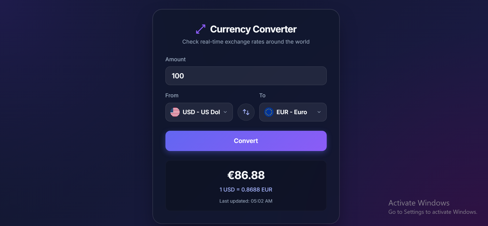

# Currency Converter

A modern and responsive **Currency Converter** web application built with **HTML, CSS, and JavaScript**. The application fetches real-time exchange rates using a public Exchange Rate API and allows users to convert currencies instantly through a clean and intuitive interface.

---

## Features

- Real-time exchange rates
- Convert between multiple currencies
- Swap currencies with one click
- Fully responsive design
- Fast and lightweight
- Error handling for failed API requests
- Modern and clean user interface

---

## Technologies Used

- HTML5
- CSS3
- JavaScript (ES6+)
- Fetch API
- Exchange Rate API

---

## Project Structure

```text
Currency-Converter/
│
├── index.html
│
├── css/
│   ├── style.css
│   └── responsive.css
│
├── js/
│   ├── script.js
│   └── api.js
│   └── ui.js
│   └── converter.js
│
│
└── README.md
```

---

## How It Works

1. Enter the amount.
2. Select the **From** currency.
3. Select the **To** currency.
4. Click **Convert Currency**.
5. The application requests the latest exchange rates from the API.
6. The converted value is displayed instantly.

---

## Preview

# Currency Converter


---

## API

This project uses the **Exchange Rate API** to fetch real-time currency exchange rates.

---

## Learning Outcomes

This project helped me practice:

- REST APIs
- Fetch API
- Async / Await
- JSON Parsing
- DOM Manipulation
- Event Handling
- Error Handling
- Responsive Web Design
- Modular JavaScript

---

## Future Improvements

- Currency search
- Country flags
- Dark mode
- Exchange rate history
- Favorite currencies
- Offline support
- Multiple language support

---

##  Author

**Muhammad Maaz Siddique**

- GitHub: https://github.com/maaziii-ust
- LinkedIn: https://www.linkedin.com/in/maaziii/

---

## Support

If you found this project useful, consider giving it a **⭐ Star** on GitHub.